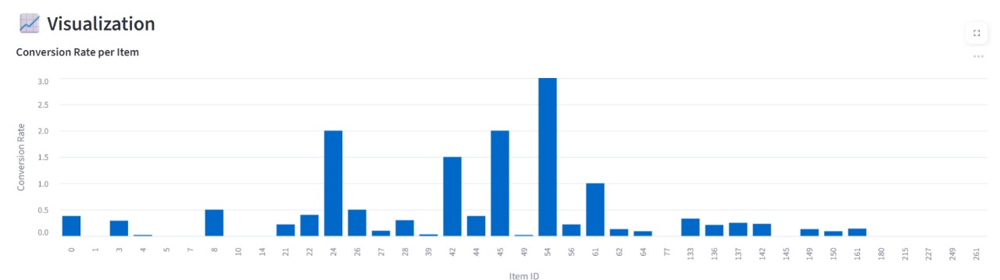
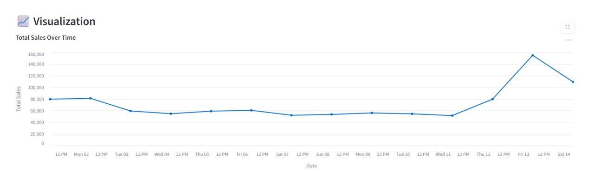
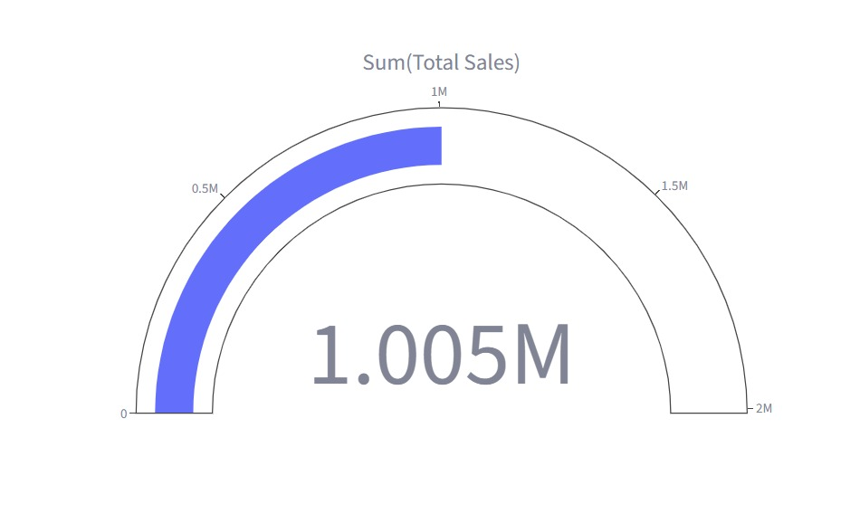

# 🚀 Offline E-commerce Insights Platform Using Mistral 7B

**Last Updated:** July 23, 2025  
**Author:** [@sanjanajainvit-arch](https://github.com/sanjanajainvit-arch)

> A powerful, privacy-respecting analytics platform for e-commerce datasets that converts natural language into SQL, powered by **Mistral 7B LLM** and **SQLite** — all running fully offline.

---

## 🌟 Key Features

✅ **Natural Language Interface**  
Ask questions like _"Which product had the highest ROAS last week?"_ — no SQL knowledge needed.

✅ **LLM-Powered SQL Generation (Offline)**  
Uses [Mistral 7B](https://ollama.com/library/mistral) via [Ollama](https://ollama.com/) to generate and execute SQLite queries, completely offline.

✅ **Data Visualizations**  
Auto-selects the best charts — bar, line, gauge — based on result types.

✅ **Streamlit UI + FastAPI Backend**  
Dual access for developers and business users — REST API + modern dashboard.

✅ **Built-in Explainability**  
The generated SQL query is always displayed for transparency and debugging.

✅ **Supports Multiple Datasets**  
Combines data from ads, sales, and product eligibility.

---

## 🗂️ Project Structure

```
.
├── main.py               # FastAPI backend for LLM + query engine
├── ui.py                 # Streamlit-based interactive dashboard
├── query_engine.py       # SQL execution + formatting
├── sql_generator.py      # Natural language → SQL via LLM
├── llm_client.py         # Interface with Ollama (Mistral)
├── utils.py              # Data loader: CSV → SQLite
├── data/
│   ├── ad_sales.csv      # Ad campaign metrics
│   ├── total_sales.csv   # Overall product sales
│   └── eligibility.csv   # Eligibility flags + reasons
├── assets/               # 📷 Screenshots & visual samples
├── requirements.txt      # All required Python packages
└── README.md
```

---

## ⚙️ Installation & Setup

### 1⃣️ Clone the Repo
```bash
git clone https://github.com/sanjanajainvit-arch/Offline-E-commerce-Insights-Platform-Using-Mistral-7B.git
cd Offline-E-commerce-Insights-Platform-Using-Mistral-7B
```

### 2⃣️ Install Dependencies
```bash
pip install -r requirements.txt
```

### 3⃣️ Prepare Your Data
Ensure the following files exist inside a `data/` folder:
- `ad_sales.csv`
- `total_sales.csv`
- `eligibility.csv`

Then load them into SQLite:
```bash
python utils.py
```

### 4⃣️ Run Ollama with Mistral
```bash
ollama run mistral
```

> _Tip: Install [Ollama](https://ollama.com) and pull the `mistral` model if not already available._

---

## 🚀 Running the App

### 🔧 Start the FastAPI Backend
```bash
uvicorn main:app --reload
```
Visit the API docs at [http://localhost:8000/docs](http://localhost:8000/docs)

### 💥 Launch the Streamlit UI
```bash
streamlit run ui.py
```

---

## 🧠 Example Questions You Can Ask

| Type                     | Example Question                                        |
|--------------------------|--------------------------------------------------------|
| Sales Summary            | What is my total sales?                                |
| Time-based Trend         | What is my total sales each day in June?              |
| ROAS / Conversion        | What is the conversion rate on 2025-06-01?             |
| Product Performance      | Which item has the highest ad spend?                   |
| Eligibility Analysis     | Which products were ineligible for ads last week?      |
| CPC/CTR/Spend Insights   | What is the average CPC per item?                      |
| Breakdown                | Show total units sold per item                         |

---

## 🤠 How Does It Work?

1. **User asks a question (UI or API)**
2. **LLM (Mistral 7B) converts it into SQL**
3. **Query is validated and run on SQLite**
4. **Formatted answer and visualization are generated**
5. **Generated SQL is shown for transparency**

---

## 📊 Sample Visuals

### 🔍 What is the conversion rate per item on 2025-06-01?


---

### 📈 What is my total sales each day in June?


---

### 🧼 What is my total sales?


---

## 🔐 Security & Safety

- SQL from the LLM is **sanitized & validated** (`SELECT`-only, no destructive queries).
- Local-only SQLite execution — **no internet or cloud dependency.**
- No user-written queries allowed directly.

---

## 🔄 API Reference

### POST `/query`
Submit a natural language question to the backend.

**Request:**
```json
{
  "question": "What is my total sales?"
}
```

**Response:**
```json
{
  "question": "...",
  "answer": "...",
  "results": [...],
  "sql": "SELECT ...;",
  "status": "success"
}
```

---

## 💡 Customizing

- Swap out Mistral with another LLM in `llm_client.py`
- Add more prompt examples to `sql_generator.py` for better accuracy
- Enhance visual logic in `ui.py` (e.g., Pie charts, filters)

---

## 🛠️ Requirements

> See `requirements.txt`

```
fastapi
uvicorn
pydantic
pandas
requests
streamlit
altair
plotly
```

---

## ❓ Troubleshooting

| Problem                        | Fix                                                              |
|-------------------------------|------------------------------------------------------------------|
| SQL errors                    | Ensure LLM returns valid SQL, see logs in `query_engine.py`      |
| Data not loading              | Re-run `python utils.py` and verify CSV paths                    |
| Ollama not responding         | Restart Ollama, verify model is pulled (`ollama run mistral`)    |
| No visualizations appearing   | Ensure Streamlit is installed and data is non-empty              |

---

## 📢 License

This project is for educational and internal use. Add your preferred license here (e.g., MIT, Apache 2.0).

---

## ⭐ Acknowledgements

- [Mistral 7B](https://mistral.ai/)
- [Ollama](https://ollama.com/)
- [Streamlit](https://streamlit.io/)
- [FastAPI](https://fastapi.tiangolo.com/)
- [Altair](https://altair-viz.github.io/) & [Plotly](https://plotly.com/)
